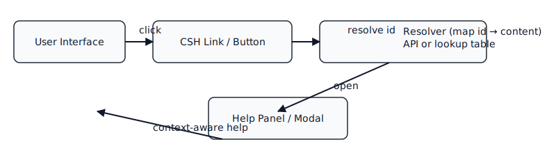

# Markdown Quick Start Guide

<div style="page-break-after: always;"></div>

© 2025 Tech Writer's Tribe

<div style="page-break-after: always;"></div>

# Table of contents

- [Introduction to Markdown](#introduction-to-markdown)
  - [Main message](#main-message)
  - [Situation](#situation)
  - [Tasks (what to do)](#tasks-what-to-do)
  - [Practical examples](#practical-examples)
  - [Best practices](#best-practices)
  - [Next steps](#next-steps)
- [MD_Mar9 - Images](#md_mar9-images)
- [Freelance Services](#freelance-services)
- [Portfolio](#portfolio)
  - [Project: User Guide](#project-user-guide)
  - [Project: Topic-based XML Content](#project-topic-based-xml-content)
- [Resume](#resume)
- [What is CSH links?](#what-is-csh-links)
  - [Summary](#summary)
  - [Why use CSH links?](#why-use-csh-links)
  - [How CSH links work (conceptually)](#how-csh-links-work-conceptually)
  - [Implementation patterns](#implementation-patterns)
    - [Simple HTML example](#simple-html-example)
    - [Data-driven example (web)](#data-driven-example-web)
  - [Accessibility and UX considerations](#accessibility-and-ux-considerations)
  - [Best practices](#best-practices-1)
  - [Common pitfalls](#common-pitfalls)
  - [Testing](#testing)
  - [Further reading](#further-reading)
  - [Product-specific examples (this site)](#product-specific-examples-this-site)

<div style="page-break-after: always;"></div>

---

<!-- === Chapter 1: Intro === -->

## Introduction to Markdown

Markdown is a lightweight syntax for writing formatted text in plain files. This lesson shows the core elements you need to create readable, maintainable documentation.

### Main message

Markdown is quick to read and write. Use it for documentation and content that will be rendered to HTML.

### Situation

Many writers create documentation directly in Markdown for websites and static sites (for example, Jekyll). This file explains the essentials and gives examples you can copy.

### Tasks (what to do)

1. Create a new `.md` file and add a short title.
2. Use headings for structure: one `#` for the page title, `##` for sections.
3. Use lists for steps and bullets, and code fences for examples.
4. Add images using relative paths (see example).

### Practical examples

#### Headings

```markdown
# Lesson title
## Section title
```

#### Lists

```markdown
- Bullet item
1. Numbered step
```

#### Code block

```html

```

#### Image (rendered)


#### Table (use simple Markdown table where possible)

```markdown
| Property | Description |
|---|---|
| Topic1 | Short description |
```

### Best practices

- Use active voice and second person where appropriate (for instructions).
- Keep paragraphs short (1–3 sentences).
- Use consistent sentence-style capitalization for headings.

### Next steps

- Add topic pages under `Chapters/` and link them from `index.md`.
- Use `data-help-id` attributes to connect UI help to these topics.

<div style="page-break-after: always;"></div>

<!-- === Chapter 1: Images === -->

## MD_Mar9 - Images

(Image examples and usage copied from original)


More image examples and notes.

<div style="page-break-after: always;"></div>

<!-- === Chapter 2: Portfolio === -->

## Freelance Services

Help about freelance services: see [Freelance services](#freelance-services).

🛠️ Technical Writing Programs  
📈 Website content 
🔧 AI tools

Reach out: **techwriterstribe@gmail.com** or on [LinkedIn](https://www.linkedin.com/in/punit-shrivastava/)

## Portfolio

Help about portfolio: see [Portfolio](#portfolio).

### Project: User Guide
Built for Tech Writer's Tribe App.  
🔗 [Live Demo](https://example.com)

---

### Project: Topic-based XML Content
Multiple topics depicted as a process flow in images.  
📷 [Screenshots](assets/images/project1.png)

## Resume

Help about resume: see [Resume](#resume).

**Skills**: HTML, CSS, JavaScript, Git, React  
**Education**: B.Tech in Computer Science  
**Experience**: Freelance Developer (2021–Present)

👉 [Download PDF Resume](assets/resume.pdf)

<div style="page-break-after: always;"></div>

<!-- === Chapter 3: CSH === -->

# What is CSH links?



## Summary

"CSH links" refers to Context‑Sensitive Help links — hyperlinks or UI hooks that open help content specifically relevant to the current screen, control, or user task. They let users get targeted assistance without searching a full help system.

## Why use CSH links?

- Reduce context switching: users get help relevant to what they're doing.
- Improve discoverability of documentation for complex UIs.
- Lower support load by surfacing inline guidance and examples.

## How CSH links work (conceptually)

A CSH link is associated with a context identifier (page, component id, or topic key). When activated it opens a help resource scoped to that identifier — e.g., a modal, a side panel, a new page anchored to a topic, or a tooltip. The mapping between context id and help content can be static (URL fragments) or dynamic (lookup table or API).

## Implementation patterns

- HTML fragment links: use anchors that point to a documentation page with a fragment, e.g. `/help/forms#field-validation`.
- Data-driven links: add `data-help-id` attributes and a small JS handler that resolves the id to a URL or content and displays it in a modal.
- Desktop apps: attach help context ids to controls and use the platform help API to open the correct topic.

### Simple HTML example

```html
<!-- link pointing to a help topic fragment -->
<a href="/help/getting-started#creating-account" class="csh-link">Help</a>
```

### Data-driven example (web)

```html
<button data-help-id="profile-edit" class="help-btn">Help</button>
```

```javascript
document.addEventListener('click', (e) => {
  const btn = e.target.closest('[data-help-id]');
  if (!btn) return;
  const id = btn.getAttribute('data-help-id');
  // map id -> URL or fetch content
  const url = `/help/topics/${id}.html`;
  openHelpModal(url);
});
```

## Accessibility and UX considerations

- Use clear, descriptive link text (avoid just "Help").
- Ensure keyboard focus moves into the help panel and back when closed.
- Provide skip/back links so users can return to their task.
- Announce opening/closing of help panels to screen readers.

## Best practices

- Keep help short and task-oriented; link to deeper docs for advanced topics.
- Maintain stable context ids so links don't break when content moves.
- Track which CSH topics are used most to improve docs and UI affordances.

## Common pitfalls

- Linking to long, generic pages — defeats the point of context sensitivity.
- Relying solely on client-side JS without fallback URLs for crawlers and plain links.

## Testing

- Verify each `data-help-id` resolves to the correct content.
- Test keyboard-only and screen-reader navigation.
- Validate links work when the app is served from different base paths.

## Further reading

- Topic-based help design patterns
- Accessibility guidelines for dialogs and modals

---

Product-specific examples and notes are included in the chapters above.
